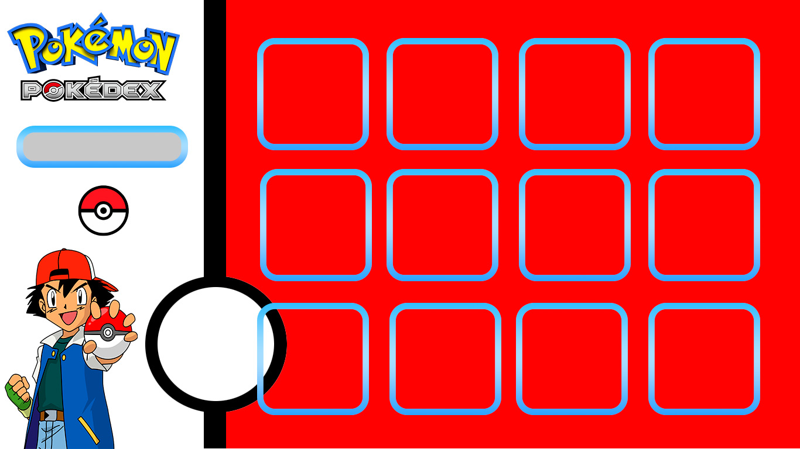

# Data Lovers

## Índice

* [1. Preámbulo](#1-preámbulo)
* [2. Resumen del proyecto](#2-resumen-del-proyecto)
* [3. Prototipo](#3-prototipo)
* [4. Historias de usuarios](#4-historias-de-usuarios)

***

## 1. Preámbulo

La historia de [Pokémon](https://pokemon.fandom.com/es/wiki/Historia_del_mundo_Pok%C3%A9mon) (abreviatura de Pocket Monsters) comienza en Japón, país en el que un amante de los videojuegos llamado Satoshi Tajiri, con apenas 25 años tuvo la idea de diseñar un sistema en el que varios jugadores pudieran interactuar en un mundo compartido. Era una idea ambiciosa para 1990, pero fue el germen de lo que años más tarde se convertiría en un suceso a nivel mundial. Tajiri tuvo la suerte de trabajar bajo la dirección del mítico Shigeru Miyamoto (padre de Mario Bros) en varios videojuegos y luego de años de elaborar la idea, presentó en febrero de 1996 su primer Pokémon para la consola portátil Game Boy. Dos versiones salieron al mercado, Pokémon: "Red" y "Green", y luego, se sumaría el "Blue". El juego era un RPG (role playing game), que ponía al jugador en un mundo lleno de criaturas a las que debían coleccionar y entrenar. El gran agregado y principal atractivo era la posibilidad de que los jugadores interactúen y pongan a combatir sus Pokémones. La fórmula era tan sencilla como adictiva, el público se volcó masivamente al juego y la crítica lo elogió hasta el hartazgo. Poco tardó en convertirse en un fenómeno global.

## 2. Resumen del proyecto

En este proyecto **se trabajó con una DATA para la creacion de una _página web_ donde la intencion es mostrar informacion acerca de los pokemones.** que se adecúe a lo que el usuario  [**maestro pokémon**](https://pokemon.fandom.com/es/wiki/Maestro_Pok%C3%A9mon?so=search)
necesita.

## 3. Prototipo

* Utilizamos colores relacionados con pokemon

* Boton de filtrar en forma de pokebola (en css).
* Intentamos fuera sencilla y agradable a la vista.

## 4. Historias de usuarios

* Mostrar la data en la interfaz
* Filtrar los pokemones por tipo
* Ordenar los pokenones por nombre de forma ascendente y descendente.

#### Testeos de usabilidad

